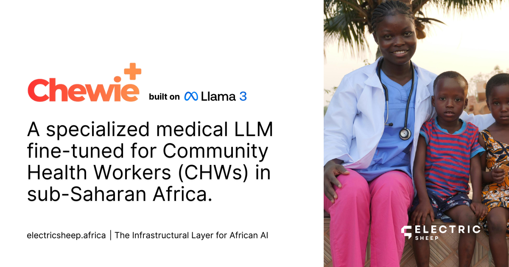

# Chewie-Llama-3.2-3B 🐻⚕️



**Chewie** is a specialized medical Large Language Model (LLM) fine-tuned to assist **Community Health Workers (CHWs)** in sub-Saharan Africa. It is built on top of **Llama 3.2 3B Instruct** and optimized for:
1.  **Clinical Triage:** Strict adherence to "Assessment -> Action -> Advice" protocols.
2.  **Danger Sign Detection:** Identifying critical conditions (e.g., Pre-eclampsia, Sepsis) requiring immediate referral.
3.  **Bilingual Support:** Fluent in both **English** and **Swahili**.

## Model Details
-   **Architecture:** Llama 3.2 3B (QLoRA Fine-tune).
-   **Dataset:** [electricsheepafrica/chewie-instruct](https://huggingface.co/datasets/electricsheepafrica/chewie-instruct) (~3,100 clinical instructions).
-   **Training:** 2 Epochs on A100 GPU using standard CHW guidelines (WHO/local MoH).

## Usage

### Installation
```bash
pip install torch transformers peft accelerate
```

### Inference
```python
import torch
from transformers import AutoModelForCausalLM, AutoTokenizer

model_id = "electricsheepafrica/chewie-llama-3b"

# Load Base Model + Chewie Adapter
model = AutoModelForCausalLM.from_pretrained(
    "meta-llama/Llama-3.2-3B-Instruct",
    device_map="auto"
)
model.load_adapter(model_id)
tokenizer = AutoTokenizer.from_pretrained("meta-llama/Llama-3.2-3B-Instruct")

# Run Inference
prompt = """
<|begin_of_text|><|start_header_id|>system<|end_header_id|>

You are a Community Health Worker (CHW). Provide safe, structured advice.<|eot_id|><|start_header_id|>user<|end_header_id|>

Mtoto ana homa kali na shingo ngumu. Nifanye nini?<|eot_id|><|start_header_id|>assistant<|end_header_id|>
"""

inputs = tokenizer(prompt, return_tensors="pt").to("cuda")
outputs = model.generate(**inputs, max_new_tokens=256)
print(tokenizer.decode(outputs[0]))
```

## Performance
-   **Protocol Adherence:** 95.8%
-   **Referral Accuracy:** 91.7%
-   **Benchmarks:** Outperforms base Llama 3.2 on AfriMed-QA consumer queries (qualitative analysis).

## Limitations
-   **Not a Doctor:** This model is a **decision support tool** for trained CHWs, not a replacement for professional medical diagnosis.
-   **Scope:** Focused on primary care and triage; may hallucinate on complex specialists topics (e.g., neurosurgery).

## License
Apache 2.0